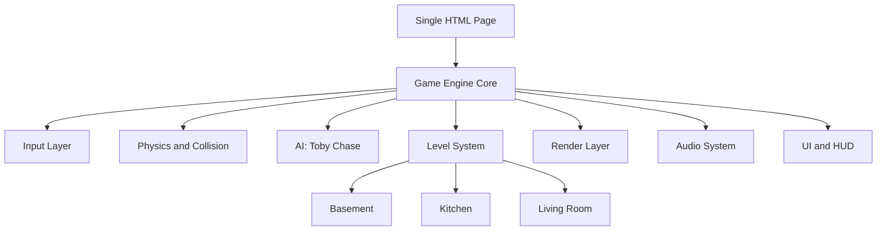
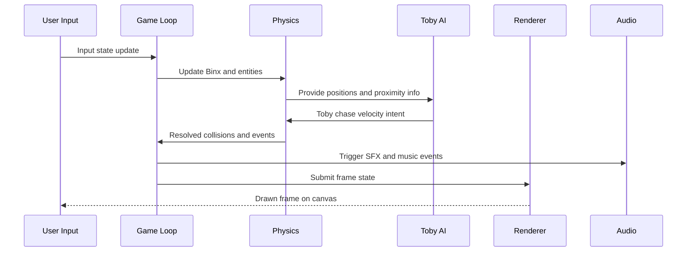

# Technical Design

## Scope and Design Goals
- Build one standalone HTML file containing game loop, rendering, level data, input systems, UI, and audio synthesis/playback.
- Preserve retro 16-bit feel through pixel-art rendering style, tile maps, and simple chiptune/sfx generation.
- Deliver desktop and mobile parity with keyboard and touch controls.

## Architecture Overview

## Core Components

### 1. Game Engine Core
- Fixed timestep update loop (for deterministic movement/collision), render on animation frames.
- Global game states: boot, playing, paused, level-transition, game-over, win.
- Central entity registry for Binx, Toby, platforms, power-ups, hazards.

### 2. Input Layer
- Desktop: keyboard mapping for move left, move right, jump.
- Mobile: on-screen touch buttons with pointer/touch events and hold support.
- Unified input interface returns actions:
  - moveX in range [-1, 1]
  - jumpPressed boolean
- Constraint: touch controls only shown on coarse pointer devices or by viewport threshold.

### 3. Physics and Collision
- Axis-aligned bounding box collision for entities and tile solids.
- Gravity and jump impulse for Binx.
- Moving platform support via platform velocity contribution to passenger entity.
- Pit detection through hazard tiles or out-of-bounds.
- Constraint: no complex rigid-body physics to keep performance high in single-page implementation.

### 4. Enemy AI: Toby
- States: patrol (optional idle roam), chase.
- Detection radius check each update.
- Chase behavior: simple steering toward Binx with collision-aware movement.
- Contact rule: Toby cannot be defeated; collision damages Binx or triggers penalty.
- Constraint: no combat system; avoid-defeat only.

### 5. Power-up System
- Types: health_restore, speed_boost, jump_boost.
- Data-driven effect definitions:
  - amount or multiplier
  - duration_ms for temporary effects
- Timed buffs tracked on Binx and expired in update loop.
- Audio cue and visual pulse on pickup.

### 6. Level System
- Level data embedded as JavaScript objects in same HTML:
  - name
  - tile grid
  - spawn points
  - moving platform paths
  - power-up placements
  - Toby spawn/detection tuning
  - exit trigger
- Required levels: basement, kitchen, living room.
- Transition pipeline:
  - freeze input
  - save carry-over state (health, score optional, active temporary effects policy)
  - load next level

### 7. Render Layer
- HTML5 Canvas 2D with imageSmoothing disabled for crisp pixels.
- Pixel-scaling strategy:
  - internal virtual resolution (for example 320x180 or 384x216)
  - integer upscale to fit viewport
- Retro palette and sprite sheets rendered as pixel blocks or tiny sprite atlas.
- Parallax or layered tile backgrounds per room theme.

### 8. Audio System
- WebAudio API for generated chiptune-like loop and effects.
- Music: simple sequencer pattern using square/triangle/noise-like timbres.
- SFX: jump, pickup, damage, level-complete, game-over.
- Mobile constraint: audio context starts on first user interaction.

### 9. UI and HUD
- HUD elements:
  - health
  - active buffs with timers
  - current level name
- Screens:
  - start/instructions
  - game over
  - win
- Mobile controls overlay with left, right, jump buttons.

## Data Schemas

### Entity Schema
- id: string
- type: binx | toby | platform | powerup | hazard | exit
- x: number
- y: number
- w: number
- h: number
- vx: number
- vy: number
- active: boolean

### Player Extension Schema
- health: number
- maxHealth: number
- speedBase: number
- jumpBase: number
- speedMultiplier: number
- jumpMultiplier: number
- buffs: array of buff objects

### Buff Schema
- kind: speed_boost | jump_boost
- multiplier: number
- expiresAtMs: number

### Level Schema
- id: string
- displayName: string
- widthTiles: number
- heightTiles: number
- tileSize: number
- tiles: string array or numeric array
- playerSpawn: x,y
- tobySpawn: x,y
- movingPlatforms: array
- powerups: array
- exit: rectangle
- theme: basement | kitchen | living_room

## Input and Event Interfaces
- handleKeyDown(event)
- handleKeyUp(event)
- handlePointerDown(controlId)
- handlePointerUp(controlId)
- getInputState(): returns moveX and jumpPressed
- applyPowerup(player, powerupType)
- damagePlayer(amount, source)

## Game Flow

## Risk, Tradeoffs, and Alternatives
1. Risk: Mobile performance drops with heavy effects.
Decision: keep low entity count and simple AI/pathing.
Alternative: degrade visual effects dynamically if frame time spikes.
2. Risk: WebAudio autoplay restrictions prevent immediate music.
Decision: start audio only after first user interaction.
Alternative: show unmissable tap-to-start overlay.
3. Risk: Single-file asset management complexity.
Decision: data-driven level objects and lightweight generated audio.
Alternative: external asset files (rejected to preserve single-file requirement).
4. Risk: Touch control precision on small screens.
Decision: large control hitboxes and responsive layout.
Alternative: swipe gestures (rejected for platformer precision).

## Requirement Traceability
1. Keyboard and touch parity maps to Requirements stories 1 and 2 through Input Layer.
2. Platform mechanics and obstacles map to stories 3 and 4 through Physics and Level System.
3. Toby behavior and non-defeatability map to stories 5 and 6 through AI and contact rules.
4. Power-ups map to story 7 through Power-up System.
5. Multi-room levels map to story 8 through Level System.
6. SNES visual/audio map to stories 9 and 10 through Render and Audio layers.
7. Win/lose states map to story 11 through Game Engine state management.
